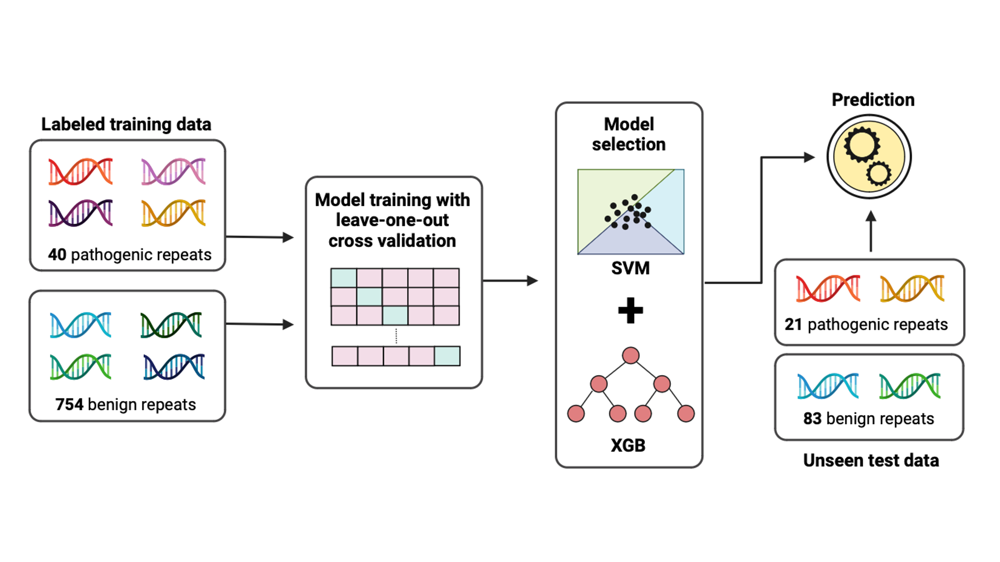

## RExPRT: a machine learning tool to predict tandem repeat pathogenicity

## Introduction

RExPRT is a machine learning Repeat Expansion Pathogenicity pRediction Tool. RExPRT goes beyond using allele frequencies of various repeat sizes to assess whether a repeat will be likely pathogenic upon expansion. Its features contain information regarding the surrounding genomic architecture, including constraint scores, overlapping regulatory regions and transcription factor binding sites, as well as gene expression. 

RExPRT requires as input the coordinates and motif for each TR to be scored. These data are then used to annotate with informative features, which are used to classify the TRs into benign and pathogenic categories based on an ensemble model of support vector machines (SVM) and XGBoost (XGB). 

The figure below illustrates a schematic of how RExPRT was trained, tested, and the methods used for selecting the best performing models.

<figure>
  <p align="center">
  
  </p>
</figure>


## Download

The latest version of RExPRT can be downloaded under [Releases](https://github.com/ZuchnerLab/RExPRT/releases).


## Prerequisites

Recommended for use with latest versions. RExPRT has been tested on the following versions:
1. [R](https://www.r-project.org) 3.6.1
2. [Python](https://www.python.org/downloads/) 3.9.2
3. [AWS client](http://docs.amazonworkspaces.com/qs_download_client.html)

Running RExPRT requires __GB of space.


## Installation

Downlaod the latest release of RExPRT and make the RExPRT.sh file executable:

```
chmod +x RExPRT.sh
```


## Basic usage

To run RExPRT using default parameters run:

```
./RExPRT.sh TR_file.txt
```

RExpRT requires one argument: a tab delimited file containing TRs. 

* This file should have at least 5 columns with the following header:

```
chr start end motif sampleID
```

* The TR coordinates (chr, start, and end sites) should be precise rather than including non-repetitive flanking sequence on either side.

* If there is no sampleID, or TRs belong to a single sample, this column is still required and should be filled with some identifying information. 


## Output
RExPRT produces a total of five scores in its output:
1. SVM - the support vector machine prediction for likelihood of pathogenicity (0 = Benign, 1 = Pathogenic)
2. XGB - the XGBoost prediction for likelihood of pathogenicity
3. EnsembleConfidence = confidence score producing by calculating a sum of the SVM and XGB scores.
5. EnsembleMax = the maximum score between the SVM and XGB predictions
4. EnsembleBinary = rounding the ensemble maximum score to the nearest integer (0 or 1).


## Citation
The manuscript is currently available on bioRxiv until the review process is complete.
LINK
